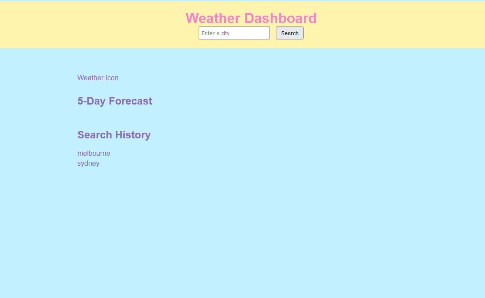
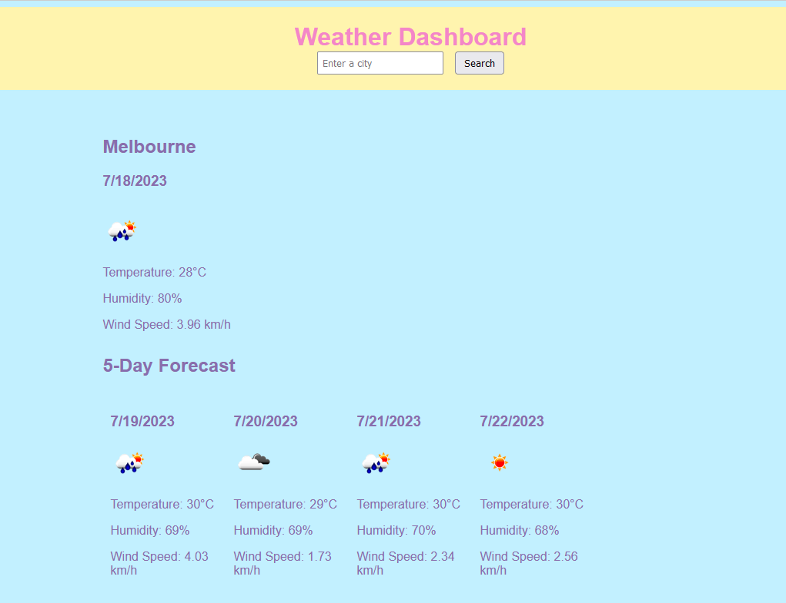

# Weather-Dashboard

Starting from scratch I was given the task of building a weather dashboard that will use the 5 Day Weather Forecast API to retrieve weather data for cities. 

This dashboard allows for you to search a city, and be presented with a range of data on that city such as weather conditions, temperature, humidity and wind speed in the form of a 5 Day Forcast.
As well as use of local storage that will create a history of previously viewed cities that would allow you to revisit these destinations easily.

## Screenshots

## Link to Deployed Application

https://shs-peb.github.io/Weather-Dashboard/
